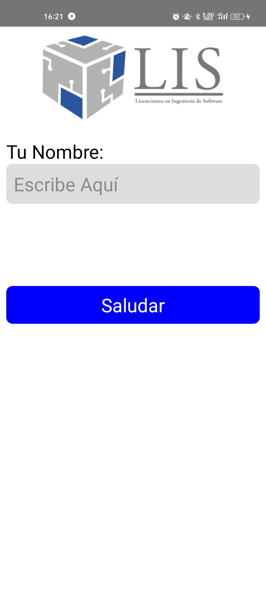
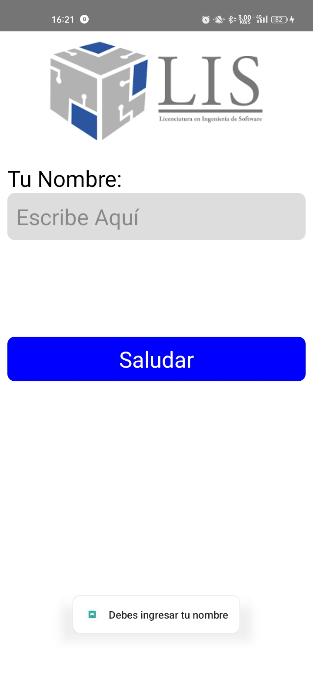
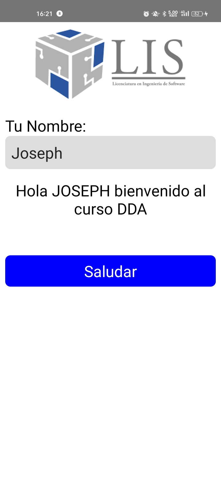

# Hello App 
To run the app locally, make shure to have installed all react-native develop enviroment, you can read [React Enviroment Setup](https://reactnative.dev/docs/environment-setup) 

i higthly recomend to use yarn to run the project instead npm, however you can use npm 

### Installation 

- Excetute 
```bash
yarn install . 
## or if you use npm 
npm install . 
```
**Note** if you have depenencies problems try install it using `--save` param

- After install dependencies, run 

```bash 
yarn run start
## or if you use npm 

npm run start
```
then press a to run in android

### Demo 
The main screen is here


Implementing the toast android using `ToastAndroid` component, this component call android API to work



the happy path of the app




